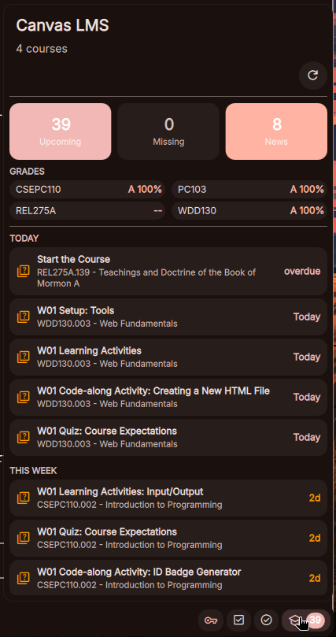

# DMS Canvas Grades

A [DankMaterialShell](https://github.com/AvengeMedia/dank-material-shell) bar widget that shows your Canvas LMS grades, upcoming assignments, missing work, and announcements — right in your status bar.

---



## Features

- **At-a-glance stat tiles** — Upcoming, Missing, and Announcements counts with color-coded urgency
- **Live grades strip** — All course grades in a compact 2-column grid, clickable to open Canvas
- **Grouped assignments** — Due items split into TODAY / TOMORROW / THIS WEEK / LATER sections
- **Assignment type icons** — Quiz, discussion, reading, and external tool assignments get distinct icons and colors
- **Mark Done** — One-click button on "none"-type assignments submits a completion to Canvas
- **Missing work** — Highlights overdue submissions with days-overdue count
- **Recent announcements** — Shows latest course announcements with post time
- **Auto-refresh** — Configurable interval (default 5 min), manual refresh button, 30s cooldown

## Installation

Install via the DMS plugin browser, or manually:

```bash
mkdir -p ~/.config/DankMaterialShell/plugins/canvasGrades
cd ~/.config/DankMaterialShell/plugins/canvasGrades
curl -sO https://raw.githubusercontent.com/mcwiseman97/dms-canvas-plugin/main/canvasGrades/CanvasWidget.qml
curl -sO https://raw.githubusercontent.com/mcwiseman97/dms-canvas-plugin/main/canvasGrades/CanvasSettings.qml
curl -sO https://raw.githubusercontent.com/mcwiseman97/dms-canvas-plugin/main/canvasGrades/plugin.json
```

Then reload DankMaterialShell.

## Configuration

1. Open DMS Settings → Plugins → Canvas Grades
2. Enter your **Canvas domain** (e.g. `byupw.instructure.com`)
3. Generate a **Canvas API token**:
   - Log in to Canvas → Account → Settings → Approved Integrations → **New Access Token**
   - Copy the token and paste it into the plugin settings
4. Optionally adjust the **refresh interval** (seconds)

## Settings

| Setting | Description | Default |
|---------|-------------|---------|
| Canvas Domain | Your institution's Canvas domain | `byupw.instructure.com` |
| API Token | Personal access token from Canvas | *(required)* |
| Refresh Interval | How often to fetch data (seconds) | `300` |

## Permissions

- `settings_read` — Read plugin configuration
- `settings_write` — Save plugin configuration
- `process_read` — Run curl/jq to fetch Canvas data

## Dependencies

- `bash`
- `curl`
- `jq`

## Contributing

Issues and PRs welcome.
